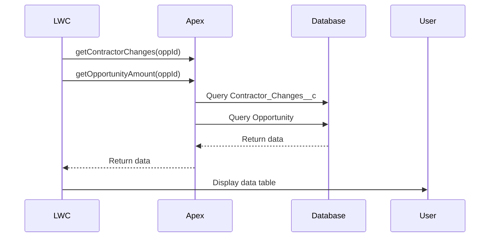

# Salesforce Solution Design

## Business Requirements:
- A Component on the Opportunity record page to make Contractor Changes.
- Display:
  - Contractor
  - Cost
  - Budget percentage
  - Budget Total (total Cost) at the bottom.
- Enable inline editing.
- Allow users to update the Cost, which will automatically update the Budget percentage (percentage of Opportunity's Amount).
- Validate on save that the total Cost must equal the Opportunity's Amount.
- Automate: When the Contractor's cost is updated, the "Change type" on the Contractor Change record is set to "Reallocation."

## Proposed Solution Overview:
- Enable inline editing to update the Cost, which updates the Budget percentage.
- Validate on save that the total Cost must equal the Opportunity's Amount.
- Automate setting the "Change type" on the Contractor Change record to "Reallocation" when the Contractor's cost is updated.
- Allow multiple record updates on save.
- Make the component accessible through the Opportunity record page.

## Technical Approach:

### Data Model Relationships:
- Opportunity (Parent)
- Contractor Changes (Child) – Lookup to Project and Contractor
- Contractor (Child) – Lookup to Project
- Contractor Billing (Child) – Lookup to Contractor
- `Budget_Percentage__c` should be stored on `Contractor_Changes__c`.

### Fields required for `Contractor_Changes__c`:
- `Budget_Percentage__c` (Decimal)
- `Contact__c` (Lookup)
- `Project__c` (Lookup)
- `Contractor__c` (Lookup)

### User Story:
As a Project Manager User,  
I want to view, edit, and validate Contractor Changes directly on the Opportunity record page with real-time budget calculations and automated tracking of reallocations,  
So that I can efficiently manage budget allocations, ensure accuracy against the Opportunity's total Amount, and maintain an audit trail for changes.

### Acceptance Criteria:
1. **View Contractor Changes on Opportunity**
   - **Given**: I am on the Opportunity record page.
   - **When**: I view the Contractor Changes component.
   - **Then**: I should see a table listing all related Contractor Change records with columns for Contractor, Cost, Budget Percentage, and a Budget Total (sum of Costs) displayed at the bottom.

2. **Inline Edit Contractor Cost**
   - **Given**: I am viewing the Contractor Changes table.
   - **When**: I click into the Cost field of a Contractor Change.
   - **Then**: I should be able to edit the Cost value directly in the table.

3. **Auto-Update Budget Percentage**
   - **Given**: I update the Cost field of a Contractor Change.
   - **When**: I enter a new value.
   - **Then**: The Budget Percentage field should automatically calculate as `(Cost / Opportunity Amount)`, formatted to two decimal places.

4. **Display Opportunity Amount and Budget Total**
   - **Given**: I am viewing the Contractor Changes component.
   - **When**: The component is refreshed.
   - **Then**: I should see the Opportunity Amount and the total Contractor Cost displayed, both formatted to two decimal places.

5. **Validate Total Cost Matches Opportunity Amount**
   - **Given**: I have made changes to Contractor Costs.
   - **When**: I click the Save button.
   - **Then**:
     - The system should validate that the total Cost equals the Opportunity Amount.
     - If the validation fails, a clear error message should be displayed, and the Save button should remain disabled.

6. **Automatically Set Change Type on Cost Update**
   - **Given**: A Contractor Change record’s Cost is modified.
   - **When**: I save the changes.
   - **Then**: The Change Type field should be automatically set to "Reallocation" before the record is updated.

7. **Bulk Save of Multiple Records**
   - **Given**: I have edited multiple Contractor Change records.
   - **When**: I click the Save button.
   - **Then**: All changes should be validated and saved in a single bulk operation.

---

## Backend Implementation:

### Apex Controller Class: `OpportunityContractorChangesController`
Develop an Apex Controller to:
- Fetch all Contractor Change records related to the Opportunity (by Opportunity Id).
- Calculate each Contractor Change's Budget Percentage `(Cost / Opportunity.Amount)`.
- Aggregate total Cost for the Budget Total.
- Accept and process inline edits from the LWC (multiple record updates).
- Ensure multiple record updates on save.
- On save, validate that the total Cost matches the Opportunity Amount.
- If a Contractor Change's Cost is updated, set its Change Type to "Reallocation" before the update.
- **Don't use a trigger**, handle this in the controller through the save action.

#### Methods:
- Get Contractor Changes
- Get Opportunity Amount
- Update Multiple Contractor Changes

#### Additional considerations:
- Methods should be marked as `@AuraEnabled(cacheable=true)` where appropriate.
- Controller should handle both single and bulk updates for backward compatibility.
- Direct business logic in controller for simpler maintenance.

---

### Apex Helper Class: `OpportunityContractorChangesHandler`
Create a Helper class to:
- Aggregate data for each Contractor Change (Contractor Name, Cost, Budget Percentage, Change Type, etc.).
- Expose calculated fields like Budget Percentage.
- Pass data efficiently to/from the LWC.
- Handle trigger operations only.
- Focus on data synchronization between Opportunity and Contractor Changes.

---

## Frontend Implementation:

### Lightning Web Component (LWC): `ContractorChanges`
- Display a table of Contractor Changes with columns:
  - Contractor (Contractor Change record)
  - Cost (editable)
  - Budget Percentage (read-only)
- Calculate and display the Budget Total (sum of Costs) at the bottom.
- Allow inline editing of the Cost field.
- Send updates to the Apex Controller on save.
- Display error messages if validation fails (i.e., if Budget Total ≠ Opportunity Amount).
- Disable save until the validation passes.
- LWC will run on the Opportunity Lightning record page.
- Ensure CRUD/FLS compliance in the Apex Controller.
- Handle exceptions and display user-friendly error messages.

#### LWC Implementation Details:
- Use `@wire` for cached data retrieval.
- Implement `refreshApex` for data refresh.
- Track draft values separately from data.
- Format currency values with 2 decimal places.
- Show both Opportunity Amount and Total Cost.
- Use `lightning-datatable` with specific column configurations.

---

### Key Considerations:
- **Performance**: Only fetch necessary fields; use aggregate queries where possible.
- **Scalability**: Build for scale, as future requirements will include adding and removing Contractor Changes.
- **Security**: Enforce field-level and object-level security in Apex.
- **Reusability**: Design the Apex handler to accept any Project Id for flexibility.
- **Code Best Practice**:
  - Ensure you use Apex best practices, including validating CRUD permissions before SOQL/DML operations.
  - Avoid using if statements without curly braces (rule: Code Style-IfStmtsMustUseBraces).
  - Validate CRUD permissions before SOQL/DML operation (rule: Security-ApexCRUDViolation).

---

### Error Handling Requirements:
- Display specific error messages for validation failures.
- Use `ShowToastEvent` for user notifications.
- Handle both Apex and UI errors.
- Include error recovery mechanisms.

---

### Performance Requirements:
- Use `cacheable=true` for read operations.
- Implement bulk operations for updates.
- Minimize server roundtrips.
- Use client-side calculations where possible.

---

### Validation Requirements:
- Use `Math.abs()` for decimal comparisons.
- Set scale for currency display (2 decimal places).
- Validate total cost against Opportunity Amount with 0.01 tolerance.

---

## Technical Flow: (Mermaid)

